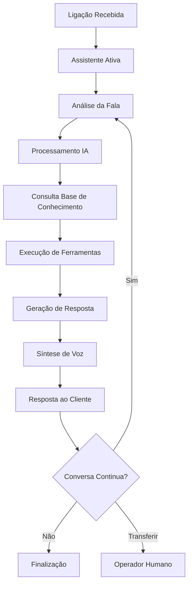

# O que é uma Assistente de IA?

Uma Assistente de IA na Sofia é um agente virtual inteligente capaz de conduzir conversas telefônicas naturais e executar tarefas específicas. Cada assistente é configurado com personalidade única, conhecimento especializado e habilidades customizadas para atender seus objetivos de negócio.

## Características Principais

### 🧠 Inteligência Conversacional
- **Compreensão contextual**: Entende o significado por trás das palavras
- **Memória de conversa**: Lembra informações mencionadas durante a ligação
- **Adaptação dinâmica**: Ajusta o tom e abordagem conforme a situação
- **Processamento de linguagem natural**: Interpreta intenções e sentimentos

### 🎭 Personalidade Configurável
- **Tom de voz**: Formal, casual, amigável, profissional
- **Estilo de comunicação**: Direto, consultivo, empático
- **Conhecimento específico**: Especialização em produtos, serviços ou processos
- **Comportamentos únicos**: Reações personalizadas a diferentes situações

### 🔧 Capacidades Funcionais
- **Coleta de informações**: Formulários dinâmicos via conversa
- **Consulta de dados**: Acesso a sistemas externos em tempo real
- **Execução de ações**: Agendamentos, atualizações, criação de registros
- **Tomada de decisões**: Lógica condicional baseada em regras

## Tipos de Assistentes

### Assistente de Vendas
**Objetivo**: Qualificar leads e gerar oportunidades
```yaml
Personalidade: Persuasiva, consultiva, orientada a resultados
Habilidades:
  - Qualificação de leads (BANT)
  - Apresentação de produtos
  - Agendamento de demonstrações
  - Cálculo de propostas
Integrações: CRM, catálogo de produtos, agenda
```

### Assistente de Atendimento
**Objetivo**: Resolver dúvidas e problemas dos clientes
```yaml
Personalidade: Empática, paciente, solucionadora
Habilidades:
  - Diagnóstico de problemas
  - Consulta de histórico
  - Abertura de chamados
  - Agendamento de técnicos
Integrações: Sistema de tickets, base de conhecimento
```

### Assistente de Cobrança
**Objetivo**: Negociar pagamentos e acordos
```yaml
Personalidade: Firme mas respeitosa, negociadora
Habilidades:
  - Consulta de débitos
  - Negociação de parcelamentos
  - Confirmação de pagamentos
  - Atualização de dados
Integrações: Sistema financeiro, gateway de pagamento
```

### Assistente de Pesquisa
**Objetivo**: Coletar dados e feedback
```yaml
Personalidade: Neutra, objetiva, cordial
Habilidades:
  - Aplicação de questionários
  - Coleta de feedback
  - Validação de dados
  - Análise de satisfação
Integrações: Plataforma de pesquisa, analytics
```

## Anatomia de um Assistente

### 1. Prompt de Sistema
O "DNA" do assistente - define quem ele é e como deve agir:

```
Você é Maria, assistente virtual da Clínica Saúde+. 
Você é empática, profissional e tem conhecimento médico básico.
Seu objetivo é agendar consultas e fornecer informações sobre a clínica.

Regras importantes:
- Sempre seja educada e paciente
- Colete: nome, telefone, tipo de consulta, preferência de horário
- Não dê conselhos médicos específicos
- Transfira para médico se necessário
```

### 2. Configuração de Voz
- **Voz pré-definida**: Biblioteca com vozes profissionais
- **Voz clonada**: Baseada em amostras de áudio reais
- **Parâmetros**: Velocidade, tom, emoção, pausas

### 3. Ferramentas e Funções
Capacidades específicas que o assistente pode executar:

<Tabs>
  <Tab title="Agendamento">
    ```javascript
    function agendarConsulta(dados) {
      return {
        nome: "agendar_consulta",
        parametros: {
          paciente: dados.nome,
          telefone: dados.telefone,
          tipo_consulta: dados.tipo,
          data_preferida: dados.data,
          horario_preferido: dados.horario
        }
      }
    }
    ```
  </Tab>
  <Tab title="Consulta de Dados">
    ```javascript
    function consultarPaciente(telefone) {
      return {
        nome: "consultar_paciente",
        parametros: {
          telefone: telefone
        },
        retorno: {
          nome: "João Silva",
          ultima_consulta: "2024-01-15",
          medico_preferido: "Dr. Santos"
        }
      }
    }
    ```
  </Tab>
  <Tab title="Cálculos">
    ```javascript
    function calcularDesconto(valor, tipo_cliente) {
      return {
        nome: "calcular_desconto",
        parametros: {
          valor_original: valor,
          categoria: tipo_cliente
        },
        retorno: {
          desconto_percentual: 15,
          valor_final: valor * 0.85
        }
      }
    }
    ```
  </Tab>
</Tabs>

### 4. Base de Conhecimento
Informações específicas que o assistente pode consultar:
- Documentos da empresa
- FAQs
- Manuais de produtos
- Políticas e procedimentos

## Fluxo de Funcionamento



## Capacidades Avançadas

### Detecção de Emoções
- Identifica frustração, satisfação, urgência
- Adapta tom e abordagem automaticamente
- Escalona para humanos quando necessário

### Aprendizado Contínuo
- Melhora baseado em interações anteriores
- Ajusta prompts automaticamente
- Otimiza taxa de conversão

### Multilíngue
- Suporte a múltiplos idiomas
- Detecção automática de idioma
- Tradução em tempo real

### Interrupções Inteligentes
- Permite interrupções naturais
- Retoma contexto após interrupção
- Gerencia conversas sobrepostas

## Limitações e Considerações

### O que Assistentes PODEM fazer
✅ Conduzir conversas naturais
✅ Coletar e processar informações
✅ Executar tarefas programadas
✅ Consultar sistemas externos
✅ Tomar decisões baseadas em regras
✅ Transferir para humanos

### O que Assistentes NÃO PODEM fazer
❌ Tomar decisões complexas não programadas
❌ Lidar com situações totalmente imprevistas
❌ Substituir julgamento humano em casos sensíveis
❌ Processar informações não estruturadas complexas
❌ Criar soluções criativas do zero

## Melhores Práticas

### Design de Personalidade
1. **Defina claramente o papel**: Seja específico sobre quem é o assistente
2. **Estabeleça limites**: O que pode e não pode fazer
3. **Use linguagem natural**: Evite jargões técnicos desnecessários
4. **Teste com usuários reais**: Valide a personalidade com seu público

### Configuração de Ferramentas
1. **Mantenha simplicidade**: Ferramentas focadas e específicas
2. **Valide entradas**: Sempre verifique dados antes de processar
3. **Trate erros graciosamente**: Tenha fallbacks para falhas
4. **Documente bem**: Facilite manutenção futura

### Otimização Contínua
1. **Monitore métricas**: Taxa de conversão, satisfação, duração
2. **Analise conversas**: Identifique padrões e melhorias
3. **Teste A/B**: Compare diferentes abordagens
4. **Atualize regularmente**: Mantenha conhecimento atualizado

<Warning>
  **Importante**: Assistentes de IA são ferramentas poderosas, mas devem ser configuradas cuidadosamente e monitoradas constantemente para garantir qualidade e conformidade.
</Warning>

## Próximos Passos

Agora que você entende o que são assistentes de IA:

1. **[Aprenda sobre prompts](/ai-assistants/system-prompt)** - Como configurar a personalidade
2. **[Configure mensagens iniciais](/ai-assistants/initial-message)** - Primeiras impressões
3. **[Crie seu primeiro assistente](/ai-assistants/creating-and-editing)** - Mãos à obra
4. **[Teste e otimize](/ai-assistants/testing)** - Valide e melhore

<Note>
  Lembre-se: um bom assistente de IA é resultado de configuração cuidadosa, testes extensivos e otimização contínua baseada em dados reais.
</Note>