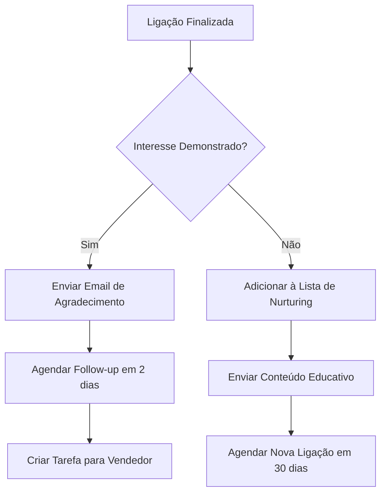
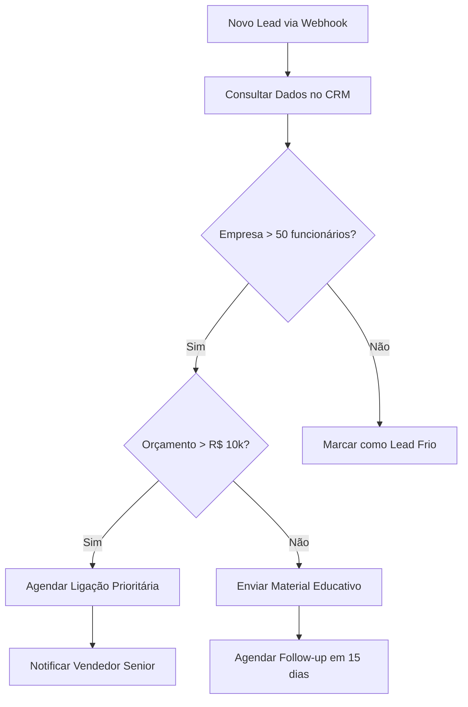
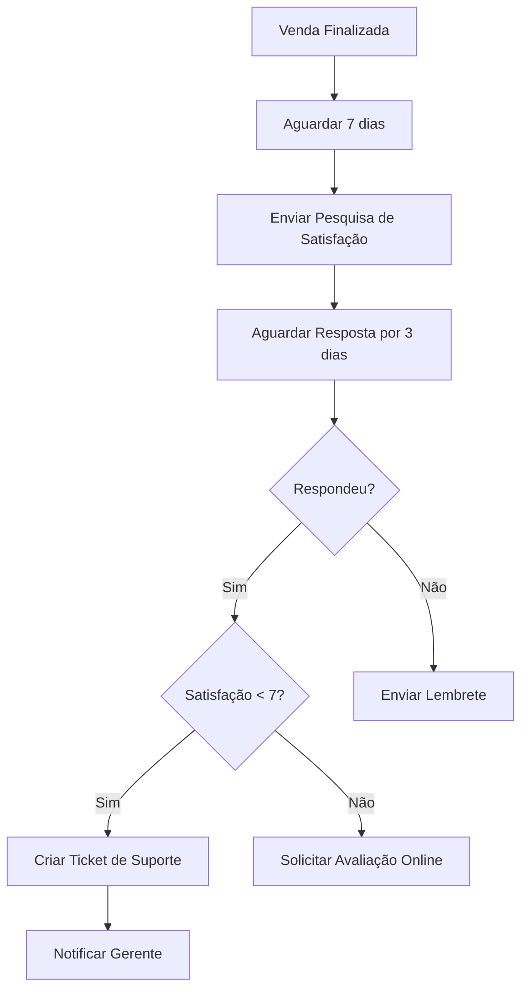

# Automação No-Code

A plataforma de automação no-code da Sofia permite criar fluxos complexos de trabalho sem necessidade de programação. Com uma interface visual intuitiva, você pode conectar sistemas, automatizar processos e criar experiências personalizadas para seus clientes.

## O que é Automação No-Code?

A automação no-code é uma abordagem que permite criar fluxos de trabalho automatizados usando uma interface visual de arrastar e soltar, eliminando a necessidade de escrever código tradicional.

### Benefícios Principais

<CardGroup cols={2}>
  <Card title="Rapidez no Desenvolvimento" icon="rocket">
    Crie automações em minutos, não em semanas
  </Card>
  <Card title="Sem Necessidade de Programação" icon="user-check">
    Qualquer pessoa pode criar fluxos complexos
  </Card>
  <Card title="Integração Fácil" icon="plug">
    Conecte com centenas de sistemas diferentes
  </Card>
  <Card title="Manutenção Simplificada" icon="wrench">
    Atualize fluxos visualmente sem tocar em código
  </Card>
</CardGroup>

## Editor Visual

### Interface Principal
O editor da Sofia oferece uma interface intuitiva com:

- **Canvas de Fluxo**: Área principal para construir automações
- **Biblioteca de Blocos**: Componentes pré-construídos
- **Painel de Propriedades**: Configuração detalhada de cada bloco
- **Simulador**: Teste fluxos antes de publicar

### Tipos de Blocos

#### Blocos de Entrada (Triggers)
- **Ligação Recebida**: Inicia quando alguém liga
- **Ligação Finalizada**: Executa após término da chamada
- **Webhook**: Ativado por sistemas externos
- **Agendamento**: Executa em horários específicos

#### Blocos de Ação
- **Enviar SMS**: Dispara mensagens de texto
- **Enviar Email**: Envia emails personalizados
- **Atualizar CRM**: Modifica dados no sistema
- **Criar Tarefa**: Gera tarefas em ferramentas de gestão

#### Blocos de Lógica
- **Condição**: Toma decisões baseadas em dados
- **Loop**: Repete ações para listas
- **Aguardar**: Pausa o fluxo por tempo determinado
- **Variável**: Armazena e manipula dados

#### Blocos de Integração
- **API REST**: Conecta com qualquer API
- **Banco de Dados**: Consulta e atualiza dados
- **Planilhas**: Integra com Google Sheets/Excel
- **Calendário**: Gerencia agendamentos

## Exemplos de Automações

### 1. Follow-up Automático de Vendas



**Configuração:**
1. **Trigger**: Ligação finalizada
2. **Condição**: Verificar se campo "interesse" = "sim"
3. **Ação**: Enviar email template "agradecimento"
4. **Ação**: Criar evento no calendário (+2 dias)
5. **Ação**: Notificar vendedor via Slack

### 2. Qualificação Automática de Leads



**Configuração:**
1. **Trigger**: Webhook de novo lead
2. **Ação**: Consultar API do CRM
3. **Condição**: Verificar tamanho da empresa
4. **Condição**: Verificar orçamento disponível
5. **Ação**: Classificar lead e agendar ação

### 3. Atendimento Pós-Venda



## Integrações Disponíveis

### CRMs
- **Salesforce**: Sincronização completa de dados
- **HubSpot**: Gestão de leads e oportunidades
- **Pipedrive**: Automação de pipeline de vendas
- **RD Station**: Marketing automation integrado

### Comunicação
- **WhatsApp Business**: Mensagens automatizadas
- **Slack**: Notificações para equipes
- **Microsoft Teams**: Colaboração empresarial
- **Discord**: Comunidades e suporte

### Produtividade
- **Google Workspace**: Emails, calendários, planilhas
- **Microsoft 365**: Suite completa de produtividade
- **Notion**: Base de conhecimento e projetos
- **Trello**: Gestão de tarefas e projetos

### E-commerce
- **Shopify**: Automação de vendas online
- **WooCommerce**: WordPress e-commerce
- **Mercado Livre**: Marketplace integration
- **Magento**: Plataforma enterprise

### Pagamentos
- **Stripe**: Processamento de pagamentos
- **PagSeguro**: Gateway brasileiro
- **Mercado Pago**: Ecossistema Mercado Livre
- **PayPal**: Pagamentos internacionais

## Configuração Passo a Passo

### 1. Criando seu Primeiro Fluxo

#### Acesso ao Editor
1. Entre no [Dashboard Sofia](https://app.sofia.ai)
2. Navegue até **"Automações"**
3. Clique em **"Criar Nova Automação"**

#### Configuração Básica
```yaml
Nome: "Follow-up de Vendas"
Descrição: "Envia email após ligações de vendas"
Categoria: "Vendas"
Status: "Rascunho"
```

### 2. Adicionando Blocos

#### Bloco Trigger
1. Arraste **"Ligação Finalizada"** para o canvas
2. Configure filtros:
   - Assistente: "Vendas"
   - Duração mínima: 60 segundos
   - Status: "Completada"

#### Bloco Condição
1. Adicione **"Condição"** após o trigger
2. Configure regra:
   - Campo: `call.metadata.interesse`
   - Operador: "igual a"
   - Valor: "sim"

#### Bloco Ação
1. Adicione **"Enviar Email"** no ramo "Sim"
2. Configure template:
   - Destinatário: `call.customer.email`
   - Assunto: "Obrigado pelo interesse!"
   - Template: "email_agradecimento"

### 3. Testando o Fluxo

#### Modo Simulação
1. Clique em **"Testar Fluxo"**
2. Forneça dados de exemplo:
```json
{
  "call": {
    "id": "call_123",
    "duration": 120,
    "status": "completed",
    "customer": {
      "email": "teste@exemplo.com"
    },
    "metadata": {
      "interesse": "sim"
    }
  }
}
```
3. Acompanhe execução passo a passo

#### Validação
- Verifique se email foi enviado
- Confirme dados corretos no template
- Teste cenários de erro

### 4. Publicando

1. Clique em **"Publicar Fluxo"**
2. Confirme configurações
3. Monitore execuções em tempo real

## Recursos Avançados

### Variáveis e Expressões

#### Variáveis do Sistema
```javascript
// Dados da ligação
call.id                    // ID único da ligação
call.duration             // Duração em segundos
call.customer.phone       // Telefone do cliente
call.customer.name        // Nome do cliente

// Dados do assistente
assistant.name            // Nome do assistente
assistant.id              // ID do assistente

// Data e hora
now()                     // Timestamp atual
today()                   // Data de hoje
addDays(date, days)       // Adicionar dias
```

#### Expressões Personalizadas
```javascript
// Formatação de dados
formatPhone(call.customer.phone)
formatCurrency(value, 'BRL')
formatDate(date, 'DD/MM/YYYY')

// Lógica condicional
if(call.duration > 300, 'Longa', 'Curta')
switch(call.status, 'completed', 'Sucesso', 'failed', 'Erro')

// Manipulação de texto
concat(customer.name, ' - ', customer.company)
upper(customer.name)
substring(customer.phone, 0, 5)
```

### Loops e Iterações

#### Processamento de Listas
```yaml
Bloco: "Para Cada Item"
Lista: leads_qualificados
Variável: lead_atual
Ações:
  - Enviar email personalizado
  - Agendar ligação
  - Atualizar status no CRM
```

#### Condições Complexas
```yaml
Bloco: "Condição Avançada"
Expressão: |
  (customer.score > 80 AND customer.budget > 10000) 
  OR 
  (customer.company_size > 100 AND customer.urgency == 'high')
```

### Tratamento de Erros

#### Configuração de Retry
```yaml
Bloco: "Enviar Email"
Configurações:
  max_tentativas: 3
  intervalo_retry: 300  # 5 minutos
  acao_falha: "notificar_admin"
```

#### Logs e Monitoramento
- Logs detalhados de execução
- Alertas para falhas recorrentes
- Métricas de performance
- Relatórios de uso

## Melhores Práticas

### Design de Fluxos

#### 1. Mantenha Simplicidade
- Um fluxo = um objetivo específico
- Evite lógica excessivamente complexa
- Use nomes descritivos para blocos

#### 2. Trate Erros Graciosamente
- Sempre configure ações de fallback
- Implemente retry para APIs externas
- Monitore e alerte sobre falhas

#### 3. Otimize Performance
- Evite loops desnecessários
- Use cache quando possível
- Limite timeouts apropriadamente

### Segurança e Compliance

#### Proteção de Dados
- Criptografe dados sensíveis
- Implemente controle de acesso
- Audite execuções regularmente

#### LGPD e Privacidade
- Obtenha consentimento para automações
- Permita opt-out fácil
- Mantenha logs de consentimento

## Monitoramento e Analytics

### Dashboard de Automações
- Execuções por período
- Taxa de sucesso/falha
- Tempo médio de execução
- Recursos mais utilizados

### Alertas Configuráveis
- Falhas consecutivas
- Tempo de execução elevado
- Uso de recursos acima do limite
- Integrações indisponíveis

<Warning>
  **Importante**: Teste sempre suas automações em ambiente de desenvolvimento antes de publicar em produção. Automações mal configuradas podem impactar negativamente a experiência do cliente.
</Warning>

## Próximos Passos

Explore mais recursos da automação:

1. **[Tutoriais em vídeo](/automation-platform/tutorials)** - Aprenda com exemplos práticos
2. **[Biblioteca de templates](/automation-platform/templates)** - Use fluxos pré-construídos
3. **[Integrações avançadas](/automation/webhook-api)** - Conecte sistemas complexos
4. **[Monitoramento](/automation/monitoring)** - Acompanhe performance

<Note>
  A automação no-code da Sofia é constantemente atualizada com novos blocos e integrações. Acompanhe nosso [changelog](/automation/changelog) para novidades.
</Note>