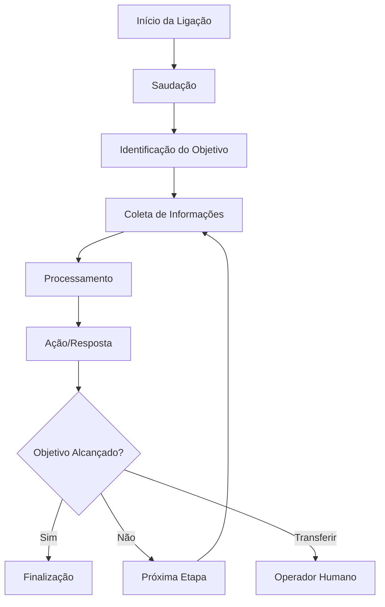

# Conceitos Fundamentais

Para usar a Sofia efetivamente, é importante compreender seus conceitos fundamentais. Esta seção aborda os pilares da plataforma e como eles trabalham juntos.

## 1. Assistentes de IA

### O que são
Os assistentes de IA são o coração da Sofia. São agentes virtuais inteligentes que podem:
- Conduzir conversas naturais por telefone
- Compreender intenções e contexto
- Executar ações específicas baseadas na conversa
- Integrar com sistemas externos

### Componentes de um Assistente

<CardGroup cols={2}>
  <Card title="Prompt de Sistema" icon="brain">
    Define a personalidade, conhecimento e comportamento do assistente
  </Card>
  <Card title="Voz" icon="microphone">
    Determina como o assistente "soa" - pode ser clonada ou pré-definida
  </Card>
  <Card title="Ferramentas" icon="wrench">
    Funções que o assistente pode executar (agendar, consultar dados, etc.)
  </Card>
  <Card title="Base de Conhecimento" icon="book">
    Informações específicas que o assistente pode consultar
  </Card>
</CardGroup>

### Exemplo de Configuração
```yaml
Nome: "Assistente de Vendas"
Prompt: "Você é um vendedor experiente da empresa XYZ..."
Voz: "Feminina, tom profissional e amigável"
Ferramentas: ["agendar_reuniao", "consultar_estoque", "calcular_desconto"]
```

## 2. Números de Telefone

### Tipos Disponíveis

#### Números Locais
- Específicos de uma cidade ou região
- Aumentam confiança e taxa de atendimento
- Ideais para negócios locais

#### Números Toll-Free (0800)
- Gratuitos para quem liga
- Transmitem profissionalismo
- Ideais para atendimento ao cliente

#### Números Internacionais
- Disponíveis em diversos países
- Permitem presença global
- Facilitam expansão internacional

### Configuração de Números
Cada número pode ser configurado para:
- **Receber ligações** (modo receptivo)
- **Fazer ligações** (modo ativo)
- **Ambos** (modo híbrido)

## 3. Fluxos de Conversa

### Estrutura Básica
Todo fluxo de conversa na Sofia segue uma estrutura:



### Elementos do Fluxo

#### Saudação
- Primeira impressão é crucial
- Deve ser natural e contextual
- Exemplo: "Olá! Aqui é a Maria da Clínica Saúde+, como posso ajudá-lo?"

#### Coleta de Informações
- Perguntas estratégicas para entender a necessidade
- Validação de dados em tempo real
- Armazenamento para uso posterior

#### Tomada de Decisão
- Baseada nas informações coletadas
- Pode consultar sistemas externos
- Determina próximos passos

#### Finalização
- Resumo do que foi acordado
- Confirmações necessárias
- Agradecimento e despedida

## 4. Integrações e Automações

### APIs e Webhooks
A Sofia se conecta com seus sistemas através de:

#### APIs REST
- Consulta de dados em tempo real
- Atualização de informações
- Sincronização bidirecional

#### Webhooks
- Notificações automáticas de eventos
- Triggers para automações
- Logs detalhados de atividades

### Exemplos de Integrações

<Tabs>
  <Tab title="CRM">
    ```javascript
    // Consultar dados do cliente
    GET /api/customers/{phone}
    
    // Atualizar status do lead
    PUT /api/leads/{id}/status
    ```
  </Tab>
  <Tab title="Calendário">
    ```javascript
    // Verificar disponibilidade
    GET /api/calendar/availability
    
    // Agendar compromisso
    POST /api/calendar/appointments
    ```
  </Tab>
  <Tab title="E-commerce">
    ```javascript
    // Consultar estoque
    GET /api/products/{sku}/stock
    
    // Criar pedido
    POST /api/orders
    ```
  </Tab>
</Tabs>

## 5. Métricas e Otimização

### KPIs Importantes

#### Taxa de Conexão
- Percentual de ligações que conectam
- Meta: > 70%
- Fatores: horário, região, caller ID

#### Taxa de Conversão
- Percentual que atinge o objetivo
- Varia por tipo de campanha
- Meta: definida por negócio

#### Duração Média
- Tempo médio de conversa
- Indica engajamento
- Impacta custos

#### Satisfação do Cliente
- Feedback direto ou indireto
- NPS das interações
- Qualidade percebida

### Otimização Contínua

#### A/B Testing
- Teste diferentes prompts
- Compare vozes e abordagens
- Analise horários ideais

#### Análise de Conversas
- Revise gravações (quando permitido)
- Identifique pontos de melhoria
- Ajuste prompts baseado em dados

#### Monitoramento em Tempo Real
- Acompanhe métricas ao vivo
- Identifique problemas rapidamente
- Faça ajustes imediatos

## 6. Boas Práticas

### Design de Prompts
- **Seja específico**: Defina claramente o papel e objetivos
- **Use exemplos**: Inclua exemplos de conversas ideais
- **Defina limites**: Estabeleça o que o assistente pode/não pode fazer
- **Teste iterativamente**: Refine baseado em resultados reais

### Configuração de Voz
- **Combine com marca**: A voz deve refletir sua identidade
- **Considere o público**: Adapte tom e estilo ao público-alvo
- **Teste qualidade**: Garanta clareza e naturalidade
- **Mantenha consistência**: Use a mesma voz em toda jornada

### Gestão de Números
- **Planeje capacidade**: Dimensione números conforme demanda
- **Monitore reputação**: Evite spam e mantenha boa reputação
- **Gerencie custos**: Otimize uso baseado em ROI
- **Backup e redundância**: Tenha números alternativos

<Warning>
  **Importante**: Sempre respeite regulamentações locais sobre ligações automatizadas, incluindo LGPD no Brasil e leis de proteção ao consumidor.
</Warning>

## Próximos Passos

Agora que você compreende os conceitos fundamentais:

1. **[Entenda o faturamento](/getting-started/understanding-billing)** - Como funciona a cobrança
2. **[Crie seu primeiro assistente](/ai-assistants/creating-and-editing)** - Mãos à obra
3. **[Configure números](/phone-numbers/purchasing-and-managing)** - Adquira seus números
4. **[Faça testes](/ai-assistants/testing)** - Valide antes de lançar

<Note>
  Lembre-se: a Sofia é uma plataforma poderosa, mas o sucesso depende de configuração cuidadosa e otimização contínua baseada em dados reais.
</Note>