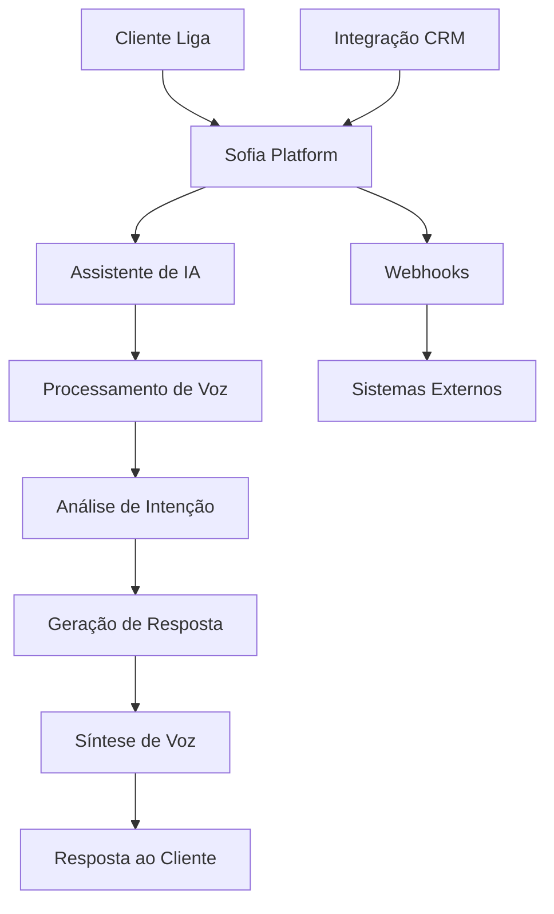

# Como Funciona (Visão Rápida)

A Sofia funciona através de um processo simples e intuitivo que permite automatizar ligações telefônicas com assistentes de IA em poucos passos.

## Fluxo básico

<Steps>
  <Step title="Crie seu Assistente de IA">
    Configure a personalidade, voz e comportamento do seu assistente através de prompts personalizados
  </Step>
  <Step title="Configure Números de Telefone">
    Adquira números locais ou internacionais para receber ou fazer ligações
  </Step>
  <Step title="Defina o Fluxo de Conversa">
    Estabeleça como o assistente deve conduzir as conversas e quais ações tomar
  </Step>
  <Step title="Teste e Ajuste">
    Faça ligações de teste para refinar o comportamento do assistente
  </Step>
  <Step title="Lance sua Campanha">
    Ative o assistente para começar a atender ou fazer ligações automaticamente
  </Step>
</Steps>

## Arquitetura da Plataforma



## Tipos de Implementação

### 1. Ligações Receptivas (Inbound)
- Cliente liga para seu número
- Sofia atende automaticamente
- Assistente conduz a conversa conforme configurado
- Pode transferir para humanos quando necessário

### 2. Ligações Ativas (Outbound)
- Sofia faz ligações para uma lista de contatos
- Assistente inicia a conversa
- Ideal para vendas, cobrança e pesquisas
- Campanhas podem ser agendadas e automatizadas

## Componentes Principais

<CardGroup cols={2}>
  <Card title="Motor de IA" icon="brain">
    Processamento de linguagem natural avançado para compreender e responder
  </Card>
  <Card title="Sistema de Voz" icon="microphone">
    Reconhecimento de fala e síntese de voz em tempo real
  </Card>
  <Card title="Gerenciador de Chamadas" icon="phone">
    Controle completo do fluxo de ligações e transferências
  </Card>
  <Card title="Plataforma de Integração" icon="plug">
    APIs e webhooks para conectar com sistemas externos
  </Card>
</CardGroup>

## Exemplo Prático: Agendamento de Consultas

Vamos ver como a Sofia pode automatizar o agendamento de consultas médicas:

### Configuração do Assistente
```
Prompt do Sistema: "Você é uma recepcionista virtual da Clínica Saúde+. 
Seu objetivo é agendar consultas de forma educada e eficiente. 
Colete: nome, telefone, tipo de consulta e preferência de horário."
```

### Fluxo da Conversa
1. **Saudação**: "Olá! Clínica Saúde+, como posso ajudá-lo?"
2. **Identificação**: "Poderia me informar seu nome completo?"
3. **Coleta de dados**: "Que tipo de consulta gostaria de agendar?"
4. **Verificação de agenda**: Consulta sistema via API
5. **Confirmação**: "Agendei sua consulta para [data/hora]. Confirma?"
6. **Finalização**: Envia confirmação por SMS/email

### Integrações
- **Sistema de agenda**: Para verificar disponibilidade
- **CRM**: Para registrar o contato
- **SMS/Email**: Para enviar confirmações
- **WhatsApp**: Para lembretes

## Vantagens Técnicas

### Processamento em Tempo Real
- Latência ultra-baixa (< 500ms)
- Reconhecimento de fala instantâneo
- Respostas naturais e fluidas

### Escalabilidade
- Milhares de ligações simultâneas
- Auto-scaling baseado na demanda
- Infraestrutura global distribuída

### Confiabilidade
- Uptime de 99.9%
- Redundância em múltiplas regiões
- Monitoramento 24/7

<Note>
  A Sofia utiliza modelos de IA de última geração, incluindo GPT-4 e tecnologias proprietárias de processamento de voz, garantindo conversas naturais e eficientes.
</Note>

## Próximos Passos

Agora que você entende como a Sofia funciona, explore:

- **[Termos-chave](/introduction/key-terminology)** - Vocabulário essencial da plataforma
- **[Conceitos fundamentais](/getting-started/core-concepts)** - Aprofunde seus conhecimentos
- **[Criando seu primeiro assistente](/ai-assistants/creating-and-editing)** - Mãos à obra!