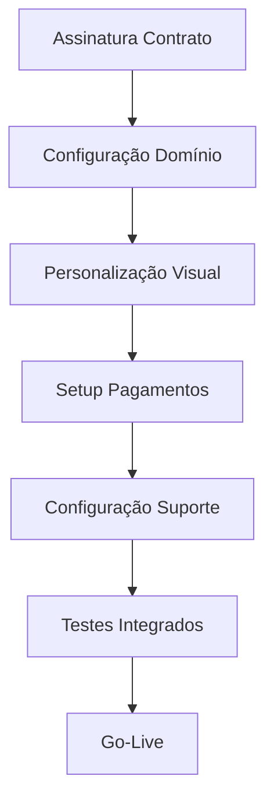

# White Label Sofia

A solução White Label da Sofia permite que você revenda nossa plataforma de IA conversacional com sua própria marca, domínio personalizado e sistema de cobrança independente. Transforme-se em um provedor de soluções de IA telefônica com tecnologia de ponta.

## O que é White Label?

White Label é um modelo de negócio onde você pode revender a tecnologia Sofia sob sua própria marca, oferecendo aos seus clientes uma solução completa de IA conversacional como se fosse desenvolvida internamente pela sua empresa.

### Benefícios Principais

<CardGroup cols={2}>
  <Card title="Marca Própria" icon="palette">
    Use sua identidade visual, logo e cores em toda a plataforma
  </Card>
  <Card title="Domínio Personalizado" icon="globe">
    app.suaempresa.com ao invés de app.sofia.ai
  </Card>
  <Card title="Controle de Preços" icon="dollar-sign">
    Defina seus próprios preços e margens de lucro
  </Card>
  <Card title="Suporte Dedicado" icon="headset">
    Equipe especializada para parceiros White Label
  </Card>
</CardGroup>

## Recursos Incluídos

### Personalização Completa

#### Interface Visual
- **Logo personalizado**: Sua marca em todas as telas
- **Cores customizadas**: Paleta de cores da sua empresa
- **Favicon personalizado**: Ícone do navegador com sua marca
- **Emails transacionais**: Templates com sua identidade

#### Domínio e URLs
- **Subdomínio personalizado**: app.suaempresa.com
- **SSL incluído**: Certificado de segurança automático
- **CDN global**: Performance otimizada mundialmente
- **Backup e redundância**: 99.9% de uptime garantido

### Sistema de Cobrança Independente

#### Gestão Financeira
- **Preços personalizados**: Defina valores para seus clientes
- **Múltiplas moedas**: Suporte a Real, Dólar, Euro e outras
- **Gateways de pagamento**: Integração com Stripe, PagSeguro, etc.
- **Faturamento automático**: Cobrança recorrente automatizada

#### Relatórios Financeiros
- **Dashboard de receita**: Acompanhe faturamento em tempo real
- **Comissões**: Sistema de comissão para vendedores
- **Impostos**: Cálculo automático de tributos
- **Exportação**: Relatórios para contabilidade

### Gestão de Clientes

#### Multi-tenancy
- **Isolamento completo**: Dados de clientes totalmente separados
- **Gestão centralizada**: Administre todos os clientes em um painel
- **Permissões granulares**: Controle de acesso por cliente
- **Auditoria**: Logs detalhados de todas as ações

#### Onboarding
- **Processo personalizado**: Fluxo de cadastro com sua marca
- **Documentação própria**: Docs com sua identidade visual
- **Suporte integrado**: Sistema de tickets personalizado
- **Treinamento**: Materiais educativos com sua marca

## Modelos de Negócio

### 1. Revenda Direta
Venda a plataforma Sofia diretamente para clientes finais:

```yaml
Modelo: B2B Direto
Público: Empresas que precisam de IA telefônica
Margem: 40-60% sobre custo Sofia
Suporte: Você atende seus clientes
Vantagem: Controle total da experiência
```

**Exemplo de Precificação:**
- Custo Sofia: R$ 0,10/minuto
- Seu preço: R$ 0,18/minuto
- Margem: R$ 0,08/minuto (80%)

### 2. Integração em Produto Existente
Adicione IA telefônica ao seu produto atual:

```yaml
Modelo: Feature Adicional
Público: Clientes existentes do seu produto
Margem: Valor agregado ao produto principal
Suporte: Integrado ao suporte existente
Vantagem: Aumenta valor do produto atual
```

**Exemplo de Implementação:**
- CRM existente + IA telefônica
- Sistema de cobrança + assistente de negociação
- Plataforma de vendas + qualificação automática

### 3. Marketplace/Plataforma
Ofereça IA telefônica em sua plataforma:

```yaml
Modelo: Marketplace
Público: Usuários da sua plataforma
Margem: Comissão sobre transações
Suporte: Compartilhado
Vantagem: Escalabilidade alta
```

## Configuração Técnica

### Requisitos Mínimos

#### Infraestrutura
- **Domínio próprio**: Para configurar subdomínio
- **Certificado SSL**: Incluído na configuração
- **DNS configurado**: Apontamento para servidores Sofia
- **Email corporativo**: Para comunicações oficiais

#### Integrações
- **Gateway de pagamento**: Stripe, PagSeguro ou similar
- **Sistema de suporte**: Zendesk, Intercom ou próprio
- **Analytics**: Google Analytics ou similar
- **CRM**: Para gestão de leads e clientes

### Processo de Setup

#### 1. Configuração Inicial (1-2 semanas)


#### 2. Personalização Visual
- Upload de logo e assets
- Definição de paleta de cores
- Customização de emails
- Configuração de favicon

#### 3. Configuração de Pagamentos
- Integração com gateway escolhido
- Definição de preços e planos
- Configuração de impostos
- Setup de faturamento recorrente

#### 4. Treinamento da Equipe
- Capacitação técnica (2 dias)
- Treinamento comercial (1 dia)
- Workshop de suporte (1 dia)
- Certificação de parceiro

## Suporte e Recursos

### Suporte Técnico Dedicado

#### Canais de Atendimento
- **Slack privado**: Canal exclusivo para parceiros
- **Email prioritário**: partners@sofia.ai
- **Telefone direto**: Linha exclusiva para emergências
- **Reuniões regulares**: Check-ins semanais/mensais

#### SLA Diferenciado
- **Resposta**: 2 horas (vs 24h padrão)
- **Resolução**: 8 horas (vs 48h padrão)
- **Disponibilidade**: 24/7 para emergências
- **Escalação**: Acesso direto à engenharia

### Materiais de Marketing

#### Assets Personalizados
- **Apresentações**: Slides com sua marca
- **Casos de uso**: Estudos de caso personalizados
- **Demos**: Ambiente de demonstração próprio
- **Vídeos**: Conteúdo educativo com sua marca

#### Suporte Comercial
- **Treinamento de vendas**: Para sua equipe comercial
- **Materiais técnicos**: Documentação para prospects
- **Suporte em reuniões**: Participação em calls importantes
- **Certificação**: Programa de certificação para vendedores

### Roadmap e Desenvolvimento

#### Influência no Produto
- **Feedback prioritário**: Suas sugestões têm peso maior
- **Features customizadas**: Desenvolvimento sob demanda
- **Beta testing**: Acesso antecipado a novidades
- **Roadmap compartilhado**: Visibilidade do que está por vir

## Investimento e Retorno

### Estrutura de Custos

#### Taxa de Setup
- **Configuração inicial**: R$ 15.000 (one-time)
- **Personalização avançada**: R$ 5.000 - R$ 20.000
- **Integrações customizadas**: R$ 10.000 - R$ 50.000
- **Treinamento presencial**: R$ 3.000/dia

#### Custos Recorrentes
- **Taxa mensal fixa**: R$ 2.000/mês
- **Custo por minuto**: R$ 0,08 (vs R$ 0,12 padrão)
- **Suporte dedicado**: Incluído
- **Atualizações**: Incluídas

### Projeção de ROI

#### Cenário Conservador
```yaml
Clientes: 10 empresas
Uso médio: 1.000 min/mês cada
Preço cobrado: R$ 0,18/min
Receita mensal: R$ 1.800
Custo Sofia: R$ 800 + R$ 2.000 = R$ 2.800
Resultado: -R$ 1.000/mês (investimento inicial)
```

#### Cenário Realista (6 meses)
```yaml
Clientes: 25 empresas
Uso médio: 2.000 min/mês cada
Preço cobrado: R$ 0,20/min
Receita mensal: R$ 10.000
Custo Sofia: R$ 4.000 + R$ 2.000 = R$ 6.000
Resultado: +R$ 4.000/mês (40% margem)
```

#### Cenário Otimista (12 meses)
```yaml
Clientes: 50 empresas
Uso médio: 3.000 min/mês cada
Preço cobrado: R$ 0,22/min
Receita mensal: R$ 33.000
Custo Sofia: R$ 12.000 + R$ 2.000 = R$ 14.000
Resultado: +R$ 19.000/mês (58% margem)
```

## Casos de Sucesso

### TechSolutions - Integrador de CRM
**Desafio**: Clientes pediam funcionalidade de IA telefônica
**Solução**: White Label Sofia integrado ao CRM existente
**Resultado**: 
- 40% aumento no ticket médio
- 25 novos clientes em 6 meses
- R$ 15.000/mês de receita adicional

### CallCenter Pro - Operador de Contact Center
**Desafio**: Competir com soluções internacionais
**Solução**: Plataforma própria com tecnologia Sofia
**Resultado**:
- 60% redução de custos operacionais
- 100 clientes migrados em 8 meses
- R$ 45.000/mês de receita recorrente

### VendaMais - Plataforma de Vendas
**Desafio**: Automatizar follow-up de leads
**Solução**: IA telefônica como feature premium
**Resultado**:
- 80% dos clientes adotaram a feature
- 35% aumento na retenção
- R$ 25.000/mês de receita adicional

## Requisitos para Parceria

### Critérios Mínimos

#### Empresa
- **Faturamento**: Mínimo R$ 500k/ano
- **Experiência**: 2+ anos no mercado
- **Equipe técnica**: Pelo menos 1 desenvolvedor
- **Suporte**: Estrutura para atender clientes

#### Mercado
- **Foco definido**: Nicho ou segmento específico
- **Pipeline**: Pelo menos 10 prospects qualificados
- **Relacionamentos**: Network no mercado-alvo
- **Credibilidade**: Referências e cases existentes

### Processo de Seleção

#### 1. Aplicação Inicial
- Formulário detalhado online
- Apresentação da empresa
- Plano de negócios preliminar
- Referências comerciais

#### 2. Avaliação Técnica
- Reunião com equipe técnica
- Avaliação de capacidade
- Discussão de integrações
- Definição de escopo

#### 3. Aprovação Comercial
- Análise de viabilidade
- Negociação de termos
- Assinatura de contrato
- Início do onboarding

<Warning>
  **Importante**: A parceria White Label é um compromisso de longo prazo. Certifique-se de ter recursos e comprometimento necessários antes de aplicar.
</Warning>

## Próximos Passos

Interessado em se tornar um parceiro White Label?

1. **[Preencha o formulário](https://sofia.ai/white-label-application)** - Candidatura inicial
2. **[Agende uma reunião](https://calendly.com/sofia-partnerships)** - Conversa com nossa equipe
3. **[Baixe o kit](https://sofia.ai/white-label-kit)** - Materiais detalhados
4. **[Entre em contato](mailto:partnerships@sofia.ai)** - Tire suas dúvidas

<Note>
  O programa White Label Sofia está em constante evolução. Novos recursos e benefícios são adicionados regularmente para nossos parceiros.
</Note>